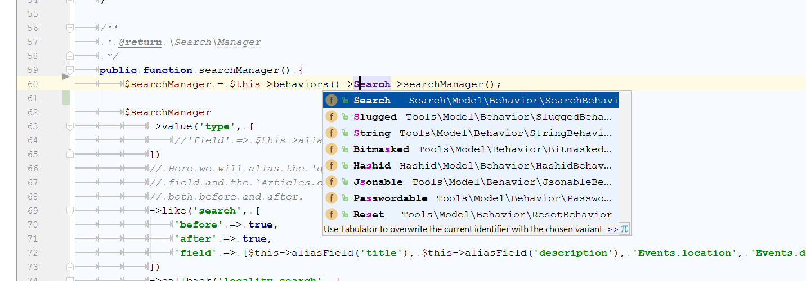

#  Code Completion File Generator

In contrast to the PhpStorm meta file generator this one is supposed to be more generic and IDE agnostic.



## Usage
This command will generate your CodeCompletion `php` files in your app's `TMP/` directory:
```
bin/cake code_completion generate
```

Those should not be persisted and will just always be regenerated or updated locally if needed.

Pro-tip: Set up a post-install-cmd hook for composer to be up to date always!

### Behaviors
```php
/** @var \Search\Manager $searchManager */
$searchManager = $this->behaviors()->Search->searchManager();
```
So far `$searchManager` required the annotation above to be typehinted and clickable, because the magic property access is not resolvable on its own.
With the generated code completion file this becomes not necessary anymore.
It will automatically detect this property as the right behavior class hint `Search` as `\Search\Model\Behavior\SearchBehavior`, making
`searchManager()` available in the IDE for method argument checking and following.


### Adding your own tasks
Just create your own Task class:
```php
namespace App\CodeCompletion\Task;

use IdeHelper\CodeCompletion\Task\TaskInterface;

class MyTask implements TaskInterface {

    const TYPE_NAMESPACE = 'Some\Namespace';

    /**
     * @return string
     */
    public function type() {
        return static::TYPE_NAMESPACE;
    }

    /**
     * @return string
     */
    public function create() {
        ...
    }

}
```

Then add it to the config:
```php
'IdeHelper' => [
    'codeCompletionTasks' => [
        'MyTask' => \App\CodeCompletion\Task\MyTask::class,
    ],
],
```
The key `'MyTask'` can be any string.

#### Replacing native tasks
Using associative arrays you can even exchange any native task with your own implementation:
```php
'IdeHelper' => [
    'codeCompletionTasks' => [
        \IdeHelper\CodeCompletion\Task\BehaviorTask::class => \App\CodeCompletion\Task\MyEnhancedBehaviorTask::class,
    ],
],
```
The native class name is the key then, your replacement the value.
Setting the value to `null` completely disables a native task.

#### Property example
So let's imagine you have the following magic properties you want to annotate:
```php
$alpha = $someObject->Alpha; // Returns \My\Cool\Alpha class
$beta = $someObject->Beta; // Returns \My\Cool\Beta class
```
Then make sure your Task's `create()` method returns something like:
```php
abstract class SomeObject extends SomeObjectInterface {

    /**
     * Alpha class.
     *
     * @var \My\Cool\Alpha
     */
    public $Alpha;

    /**
     * Beta class.
     *
     * @var \My\Cool\Beta
     */
    public $Beta;

}
```

We can use `abstract` keyword to avoid direct implementation hinting.

#### Method example
Let's imagine you have the following magic methods you want to annotate:
```php
$alpha = $someObject->alpha(); // Returns \My\Cool\Alpha class
$beta = $someObject->beta(); // Returns \My\Cool\Beta class
```
Then make sure your Task's `create()` method returns something like:
```php
abstract class SomeObject extends SomeObjectInterface {

    /**
     * Alpha class.
     *
     * @var \My\Cool\Alpha
     */
    protected $alpha;

    ...

    /**
     * @return \My\Cool\Alpha
     */
    public function search() {
        return $this->alpha;
    }

    ...

}
```

### Custom path for files

Using Configure key `'IdeHelper.codeCompletionPath'` you can use a custom path in your project if needed.
This way the files can be added to version control.
